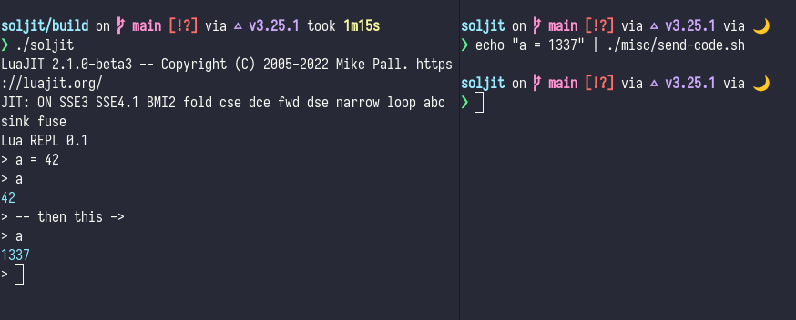

# LuaJIT + sol3 + lua-repl

Relocatable LuaJIT distribution with REPL (tab completion, pretty printing etc.) based on the excellent sol3 C++/Lua bindings.

* REPL provided by [lua-repl](https://github.com/hoelzro/lua-repl)
* [Sol3](https://github.com/ThePhD/sol2)

`hererocks` is required during build: `pipx install hererocks`

# Building and installing

Clone with `git clone --recursive https://github.com/Simon-L/luajit-sol3-repl`

Building and installing nng (not systemwide!) before everything is required.
```
cmake -S libs/nng -B libs/nng/build
cmake --build libs/nng/build
cmake --install libs/nng/build --prefix prefix
```

Building the hererocks target first is required.
```
cmake -Bbuild
cmake --build build -j16 -t hererocks
cmake --build build -j16
```

See the [BUILDING](BUILDING.md) document.

# Usage

This should be a pretty standard *decent* lua interpreter:
```
./soljit
```



There is a single route currently: `http://127.0.0.1:8888/api/eval` send POST request to this endpoint to execute the code in the REPL.  
Request must contain the follow JSON data:
```json
{
  "code": "<base64 encoded string>"
}
```

The `misc/` folder contains a shell script and a lua script to make this easy. The `misc/send-selection` folder is an unfinished package for the Pulsar editor to send selected line(s) to the interpreter, aka. livecoding style!.

- Using the shell script: `cat script.lua | ./misc/send-code.sh`
- Using the lua version: `cat script.lua | build/bin/lua misc/send-code.lua`

The dependencies for send-code.lua are `lua-requests` and `lbase64`. Let's just install these locally in our build:
```bash
source build/bin/activate
luarocks install lua-requests
luarocks install lbase64
# if lua-requests fails to install because of C++17 incompatibilities, run this first and try again:
wget https://gist.githubusercontent.com/ossie-git/ffddb4fd619c93db6baa45b62a65b89b/raw/09cc71a13ed3c7e772e51bba01c0602b1e7504c8/xml-1.1.3-1.rockspec
luarocks install xml-1.1.3-1.rockspec
```


# Contributing

See the [CONTRIBUTING](CONTRIBUTING.md) document.

# Licensing

MIT
